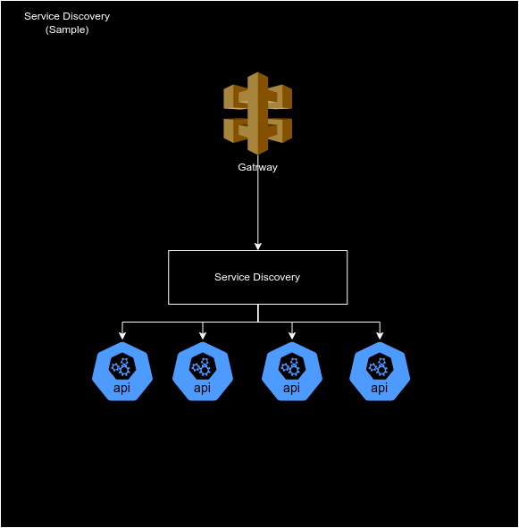

# Exemplo de Service Discovery

O presente projeto tem como objetivo exemplificar a utilização de service discovery utilizando Eureka. 

## Estrutura

- Api-gateway: Gateway utilizando Reactive Gateway
- order-api: Spring App
- payment-api: Spring App
- service-discovery: Eureka Server
